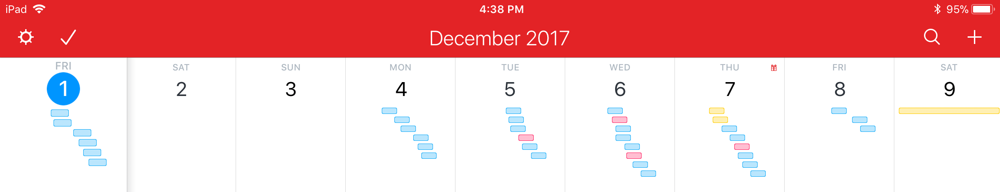

# portfolio

Provides at a glance view of all Duke Learning Innovation projects with some contextual meaning and status updates. For external sharing.

Portfolio has annual view showing how many projects running at once for each person. Like this but the days of the week are people and the colored lines represent project timeline for the entire year  

### How to use this repository

Duke Learning Innovation staff can follow these instructions to update their projects in the portfolio

1. Download Github Desktop [https://desktop.github.com/](https://desktop.github.com/)
2. Clone [https://github.com/DukeLearningInnovation/portfolio](https://github.com/DukeLearningInnovation/portfolio)
3. Create a new branch
4. Create a markdown file for one of the projects you're managing.
5. Change the name in index.md if necessary
6. Commit changes
7. Pull Request

[docs/index.md](/docs/index.md "Index")

